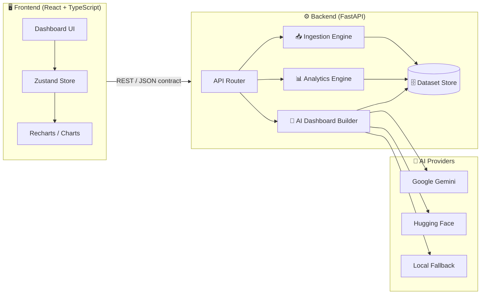

<div align="center">

```
██╗███╗   ██╗███████╗██╗ ██████╗ ██╗  ██╗████████╗███████╗ ██████╗ ██████╗  ██████╗ ███████╗
██║████╗  ██║██╔════╝██║██╔════╝ ██║  ██║╚══██╔══╝██╔════╝██╔═══██╗██╔══██╗██╔════╝ ██╔════╝
██║██╔██╗ ██║███████╗██║██║  ███╗███████║   ██║   █████╗  ██║   ██║██████╔╝██║  ███╗█████╗  
██║██║╚██╗██║╚════██║██║██║   ██║██╔══██║   ██║   ██╔══╝  ██║   ██║██╔══██╗██║   ██║██╔══╝  
██║██║ ╚████║███████║██║╚██████╔╝██║  ██║   ██║   ██║     ╚██████╔╝██║  ██║╚██████╔╝███████╗
╚═╝╚═╝  ╚═══╝╚══════╝╚═╝ ╚═════╝ ╚═╝  ╚═╝   ╚═╝   ╚═╝      ╚═════╝ ╚═╝  ╚═╝ ╚═════╝ ╚══════╝
```

### *Upload any dataset. Prompt in plain English. Get a full dashboard — instantly.*

<br/>

[](https://python.org)
[](https://fastapi.tiangolo.com)
[](https://react.dev)
[](https://typescriptlang.org)
[](https://tailwindcss.com)
[](https://ai.google.dev)

<br/>

[**Live Demo**](https://insightforge-ai-self.vercel.app/) · [**API Docs**](https://insightforge-ai-yycn.onrender.com/docs) · [**Report Bug**](#) · [**Request Feature**](#)

<br/>

</div>

---

## ⚡ What is InsightForge AI?

InsightForge AI is a **full-stack, AI-powered analytics platform** that transforms raw datasets into beautiful, interactive dashboards — with zero manual configuration.

Drop in a CSV. Connect a REST API. Describe what you want in plain English. InsightForge analyzes your data's schema, runs statistical profiling, recommends the right visualizations, and assembles a complete dashboard — powered by Gemini, Hugging Face, or a blazing-fast local fallback.

> **The LLM never sees your raw data.** It only receives schema metadata and widget candidates. All chart data and dashboard logic stays on your backend. Privacy-first by design.

---

## 🎬 How It Works

```
┌─────────────────────────────────────────────────────────────────────────┐
│                                                                         │
│   1. INGEST          2. ANALYZE           3. GENERATE        4. RENDER  │
│                                                                         │
│   CSV / Excel  ──►  Schema profiling  ──►  AI selects    ──►  React    │
│   JSON / API        Statistics             widgets            charts    │
│                     Insights              Names dashboard     KPIs      │
│                     Chart candidates      Returns JSON        Tables    │
│                                                                         │
└─────────────────────────────────────────────────────────────────────────┘
```

---

## 🏗️ Architecture



---

## 🛠️ Tech Stack

| Layer | Technology | Purpose |
|---|---|---|
| **Frontend** | React 18 + TypeScript | Component-based dashboard UI |
| **Styling** | TailwindCSS | Utility-first responsive design |
| **State** | Zustand | Lightweight global state management |
| **Charts** | Recharts | Composable, animated data visualizations |
| **Backend** | FastAPI (Python) | High-performance async REST API |
| **AI — Primary** | Google Gemini 2.0 Flash | Widget selection + dashboard naming |
| **AI — Alternate** | Hugging Face Inference | Open-source LLM alternative |
| **AI — Fallback** | Local deterministic rules | Zero-dependency, zero-latency fallback |

---

## 🚀 Local Setup

### Prerequisites

- Python `3.11+`
- Node.js `18+`
- (Optional) Gemini API key or Hugging Face token

### Backend

```bash
cd backend

# Create and activate virtual environment
python -m venv .venv
.venv\Scripts\activate          # Windows
# source .venv/bin/activate     # macOS / Linux

# Install dependencies
pip install -r requirements.txt

# Start the server
uvicorn app.main:app --reload
```

> API running at → `http://localhost:8000`  
> Interactive docs at → `http://localhost:8000/docs`

### Frontend

```bash
cd frontend
npm install
npm run dev
```

Open `http://localhost:5173`. The API runs at `http://localhost:8000`.

If you want the frontend to use the deployed Render backend, create `frontend/.env`:

```bash
VITE_API_BASE_URL=https://insightforge-ai-yycn.onrender.com
```

For a local backend, use:

```bash
VITE_API_BASE_URL=http://localhost:8000
```

When deploying the frontend, set the same `VITE_API_BASE_URL` value in the hosting provider environment variables.

## Production Deployment

Current deployed URLs:

```text
Frontend: https://insightforge-ai-self.vercel.app/
Backend:  https://insightforge-ai-yycn.onrender.com
API Docs: https://insightforge-ai-yycn.onrender.com/docs
```

Set this environment variable in Vercel:

```env
VITE_API_BASE_URL=https://insightforge-ai-yycn.onrender.com
```

If Vercel currently has `VITE_API_BASE_URL=http://localhost:8000`, remove it or replace it with the Render URL above, then redeploy. The production frontend also guards against localhost values and falls back to Render.

Set these environment variables in Render:

```env
ENVIRONMENT=production
FRONTEND_ORIGIN=https://insightforge-ai-self.vercel.app
AI_PROVIDER=gemini
GEMINI_API_KEY=your_gemini_key
GEMINI_MODEL=gemini-2.0-flash
```

If you want Hugging Face instead of Gemini on Render:

```env
ENVIRONMENT=production
FRONTEND_ORIGIN=https://insightforge-ai-self.vercel.app
AI_PROVIDER=huggingface
HUGGINGFACE_API_KEY=your_hf_token
HUGGINGFACE_MODEL=Qwen/Qwen2.5-7B-Instruct
HUGGINGFACE_PROVIDER=auto
```

After changing Vercel or Render environment variables, redeploy that service so the new values are loaded.

## Manual Dashboard Control

The app supports both AI-generated dashboards and manual chart building.

Manual controls let users choose:

- chart type: bar, horizontal bar, line, pie, histogram, scatter
- X axis column
- Y metric column
- aggregation: sum, mean, count, min, max, none
- custom chart title

The backend profiles each column before recommending metrics. Columns that look like identifiers, such as `id`, `postal_code`, `zip`, `phone`, or `account_number`, are not used for KPI totals. They can still be used as chart axes when the user explicitly chooses them.

Prompt examples that now work:

```text
plot revenue with region
plot revenue with postal code as bar chart
show average order value by country
make a scatter chart of revenue and orders
```

Each chart can include a generated insight. Dashboards can be exported by using the `Export PDF` button, which opens the browser print dialog with a print-optimized dashboard layout.

## Dashboard Q&A

Users can select one or more dashboard widgets and ask questions about them. Typing `@` in the dashboard chat opens a widget dropdown, so the answer can be grounded in specific charts, KPIs, or tables.

The backend RAG endpoint is:

```text
POST /dashboard/ask
```

It retrieves context from the uploaded pandas dataset, detected column profiles, dataset statistics, selected widget data, and row samples. Set `AI_PROVIDER=balanced` and provide both Gemini and Hugging Face keys to rotate between providers and fail over automatically. If both providers fail or rate-limit, the app returns a local grounded pandas/vector fallback. Current persistence is still the MVP in-memory dataset store, so Supabase-backed retrieval should be wired when the Supabase phase is added.

The app also includes a dark/light mode toggle in the sidebar.

## AI provider setup

The backend supports three AI modes:

- `local`: no external API. Uses deterministic prompt rules.
- `gemini`: uses Google Gemini API.
- `huggingface`: uses Hugging Face Inference Providers.

Create `backend/.env` from `backend/.env.example`, then choose a provider.

Gemini:
> App running at → `http://localhost:5173`

---

## 🤖 AI Provider Configuration

Copy the environment template and pick your provider:

```bash
cp backend/.env.example backend/.env
```

<details>
<summary><b>🔵 Local — No API key required (default)</b></summary>

```env
AI_PROVIDER=local
```

Uses deterministic prompt rules. Instant. No external calls. Great for development.

</details>

<details>
<summary><b>🟣 Google Gemini (recommended for production)</b></summary>

```env
AI_PROVIDER=gemini
GEMINI_API_KEY=your_gemini_key
GEMINI_MODEL=gemini-2.0-flash
```

</details>

<details>
<summary><b>🟡 Hugging Face Inference</b></summary>

```env
AI_PROVIDER=huggingface
HUGGINGFACE_API_KEY=your_hf_token
HUGGINGFACE_MODEL=Qwen/Qwen2.5-7B-Instruct
HUGGINGFACE_PROVIDER=auto
```

</details>

> **How the AI is used (and what it never sees):**  
> The LLM receives only: column names, data types, row/column counts, and a list of candidate widget descriptors.  
> It returns: a dashboard title + selected widget indexes.  
> Chart data, statistics, and the final dashboard JSON are assembled entirely server-side.

---

## 📡 API Reference

| Method | Endpoint | Description |
|--------|----------|-------------|
| `POST` | `/upload/csv` | Upload a `.csv` file |
| `POST` | `/upload/excel` | Upload a `.xlsx` / `.xls` file |
| `POST` | `/upload/json` | Upload a `.json` file |
| `POST` | `/connect/api` | Connect an external REST API as a datasource |
| `GET` | `/dataset/{id}/summary` | Schema overview: columns, types, shape |
| `GET` | `/dataset/{id}/statistics` | Per-column stats: mean, median, nulls, distribution |
| `GET` | `/dataset/{id}/charts` | AI-recommended chart configurations |
| `GET` | `/dataset/{id}/insights` | Natural-language dataset insights |
| `POST` | `/ai/generate-dashboard` | Generate a full dashboard from a text prompt |

---

## 📁 Project Structure

```
insightforge-ai/
│
├── backend/
│   ├── app/
│   │   ├── main.py              # FastAPI app entry point
│   │   ├── routers/             # Upload, dataset, AI route handlers
│   │   ├── services/
│   │   │   ├── ingestion.py     # CSV / Excel / JSON / API parsers
│   │   │   ├── analytics.py     # Statistics & chart recommendation engine
│   │   │   └── ai_builder.py    # Gemini / HuggingFace / local AI logic
│   │   └── models/              # Pydantic schemas & dashboard contract
│   ├── .env.example
│   └── requirements.txt
│
└── frontend/
    ├── src/
    │   ├── components/          # Chart, KPI, Table, Filter widgets
    │   ├── store/               # Zustand state slices
    │   ├── pages/               # Upload, Dashboard, Insights views
    │   └── types/               # Dashboard contract TypeScript types
    ├── tailwind.config.ts
    └── vite.config.ts
```

---

## 🗺️ Roadmap

- [x] CSV, Excel, JSON, REST API ingestion
- [x] Automatic schema profiling + statistics
- [x] AI dashboard generation (Gemini / Hugging Face / local)
- [x] Dynamic React dashboard from JSON contract
- [ ] **Supabase** — PostgreSQL + Storage persistence
- [ ] **Auth** — User accounts and saved dashboards
- [ ] **LLM hardening** — Structured JSON output + validation + retries
- [ ] **Server-side filters** — Filter widgets that push queries to backend
- [ ] **Collaboration** — Team sharing, dashboard templates, SaaS billing

---

## 🤝 Contributing

Contributions are welcome. Please open an issue first for significant changes.

1. Fork the repository
2. Create a feature branch: `git checkout -b feature/your-feature`
3. Commit with clear messages: `git commit -m "feat: add X"`
4. Push and open a pull request

---

## 📄 License

MIT License — see [LICENSE](./LICENSE) for details.

---

<div align="center">

**Built with FastAPI · React · Gemini AI**

*If this project helped you, consider giving it a ⭐*

</div>
