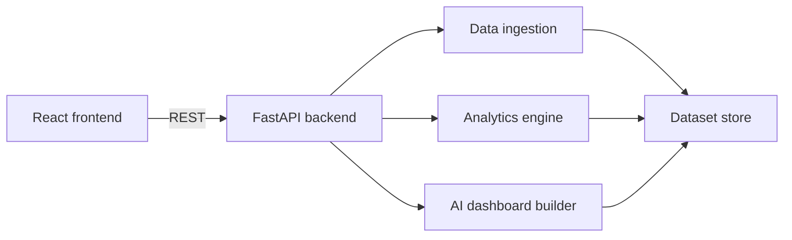

# InsightForge AI

AI-powered dynamic dashboard generator for dataset ingestion, automatic analytics, visualization recommendation, and prompt-driven dashboard creation.

## What is built

- `backend/`: FastAPI app with CSV, Excel, JSON, and REST API ingestion.
- `frontend/`: React, TypeScript, TailwindCSS, Zustand, and Recharts dashboard UI.
- Dynamic dashboard contract: the backend returns widget JSON, and the frontend renders charts, KPIs, tables, and filters from config.
- Gemini and Hugging Face AI provider hooks, plus a deterministic local fallback when no API key is configured.

## Local setup

Backend:

```bash
cd backend
python -m venv .venv
.venv\Scripts\activate
pip install -r requirements.txt
uvicorn app.main:app --reload
```

Frontend:

```bash
cd frontend
npm install
npm run dev
```

Open `http://localhost:5173`. The API runs at `http://localhost:8000`.

If you want the frontend to use the deployed Render backend, create `frontend/.env`:

```bash
VITE_API_BASE_URL=https://insightforge-ai-yycn.onrender.com
```

For a local backend, use:

```bash
VITE_API_BASE_URL=http://localhost:8000
```

When deploying the frontend, set the same `VITE_API_BASE_URL` value in the hosting provider environment variables.

## AI provider setup

The backend supports three AI modes:

- `local`: no external API. Uses deterministic prompt rules.
- `gemini`: uses Google Gemini API.
- `huggingface`: uses Hugging Face Inference Providers.

Create `backend/.env` from `backend/.env.example`, then choose a provider.

Gemini:

```bash
AI_PROVIDER=gemini
GEMINI_API_KEY=your_gemini_key
GEMINI_MODEL=gemini-2.0-flash
```

Hugging Face:

```bash
AI_PROVIDER=huggingface
HUGGINGFACE_API_KEY=your_huggingface_token
HUGGINGFACE_MODEL=Qwen/Qwen2.5-7B-Instruct
HUGGINGFACE_PROVIDER=auto
```

The LLM does not receive the full dataset. It receives schema, row/column counts, and candidate widgets, then returns a dashboard name and selected widget indexes. The backend still owns chart data and final dashboard JSON.

## API highlights

- `POST /upload/csv`
- `POST /upload/excel`
- `POST /upload/json`
- `POST /connect/api`
- `GET /dataset/{id}/summary`
- `GET /dataset/{id}/statistics`
- `GET /dataset/{id}/charts`
- `GET /dataset/{id}/insights`
- `POST /ai/generate-dashboard`

## Architecture



## Next implementation phases

1. Supabase PostgreSQL and Storage persistence.
2. Authentication and saved dashboards.
3. Stronger LLM prompt planning with structured JSON validation and retries.
4. Filters that update chart data server-side.
5. Team sharing, dashboard templates, and SaaS billing.
